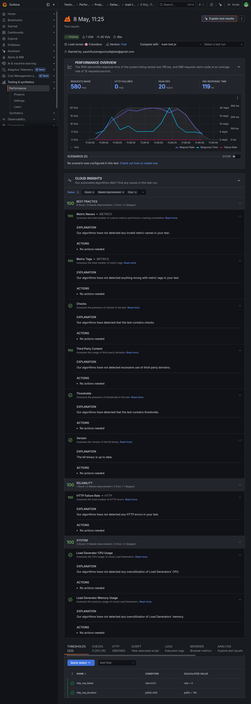
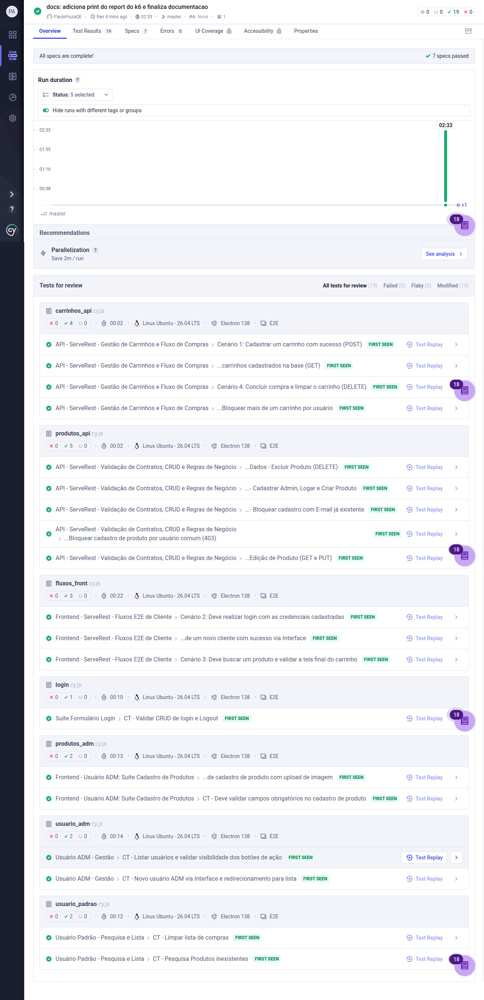

# 🚀 QA Automation E2E - ServeRest Ambev

[](https://www.cypress.io/)
[](https://k6.io/)
[](https://www.docker.com/)
[](https://azure.microsoft.com/)

Repositório desenvolvido para o desafio técnico de **Engenharia de Qualidade da AMBEV**. O objetivo é garantir a resiliência, performance e corretude do sistema [ServeRest](https://serverest.dev/), aplicando o estado da arte em testes automatizados.

---

## 🎯 Arquitetura do Projeto

Este framework não foca apenas em "clicar em botões". Ele foi desenhado seguindo a **Pirâmide de Testes** e estratégias de validação contínua:

1. **Testes de API (Backend):** Validação de contratos, schemas e regras de negócio (RBAC, CRUD completo).
2. **Testes E2E (Frontend):** Simulação da jornada real do usuário (Padrão e Administrador).
3. **Testes de Performance:** Validação de stress e picos de acesso com **K6** na rota de produtos.
4. **CI/CD & Infra:** Containerização com **Docker** e pipeline configurada para o **Azure DevOps**.

---

## ⚙️ Ferramentas Utilizadas

* **[Cypress](https://www.cypress.io/)** - Core da automação (Front & API).
* **[Faker-js](https://fakerjs.dev/)** - Geração de massa de dados dinâmica (Evita testes flakies).
* **[Grafana K6](https://k6.io/)** - Testes de Carga e thresholds de performance.
* **[Docker](https://www.docker.com/)** - Padronização do ambiente de execução.

---

## 🚀 Como Executar o Projeto Localmente

### Pré-requisitos
* Node.js (v18 ou superior)
* K6 instalado na máquina (para performance)

### 1. Clonar e Instalar
```bash
git clone [https://github.com/PauloFiuzaQE/qa-automation-e2e-serverest-ambev.git](https://github.com/PauloFiuzaQE/qa-automation-e2e-serverest-ambev.git)
cd qa-automation-e2e-serverest-ambev
npm install
```


### 2. Executar Testes Funcionais (Cypress)
* Para abrir o painel interativo (Modo Interface):
```bash
npx cypress open
```
* Para rodar em background (Modo Headless/Pipeline):
```bash
npx cypress run
```

### 3. Executar Testes de Performance (K6)
Para avaliar a latência e SLA da API de produtos via terminal:
```bash
k6 run performance/load-test.js
```
📊 **📊 Report Dinâmico Visual de Performance:
(https://paulofiuzaqe.grafana.net/a/k6-app/runs/7486201)**

**📊 Report Estático Visual de Performance:**

---

## 📖 Documentação de Cenários (BDD)

Toda a lógica de negócios e cobertura de testes foi mapeada utilizando a sintaxe **Gherkin**.
👉 [Clique aqui para ler os Cenários de Teste mapeados (GHERKIN.md)](./GHERKIN.md)

---

## 🏗️ Esteira de CI/CD (Azure Pipelines)

O projeto conta com um arquivo `azure-pipelines.yml` pronto para integração. O fluxo garante que:
1. Uma imagem Docker é construída usando o Node 18.
2. O Cypress roda os testes em ambiente limpo de forma *headless*.
3. O deploy só é liberado se 100% da suíte passar.

---
## 📈 KPIs & Health Check (Cypress Cloud)

Para garantir a confiabilidade e o monitoramento da saúde dos testes, este projeto está integrado ao **Cypress Cloud**.

* **Total de Cenários:** 19 validados
* **Arquivos de Spec:** 7 specs (API e Frontend)
* **Taxa de Sucesso:** 100% (Zero falhas)
* **Ambiente de CI:** Linux Ubuntu (via GitHub Actions)

---

### 🔗 Dashboard Dinâmico
[👉 Acessar Execução em Tempo Real no Cypress Cloud](https://cloud.cypress.io/projects/vya8be/runs/1)

### 📸 Evidência Estática (Health Check)


*Desenvolvido por **Paulo Fiuza** - Analista de Qualidade Sênior*